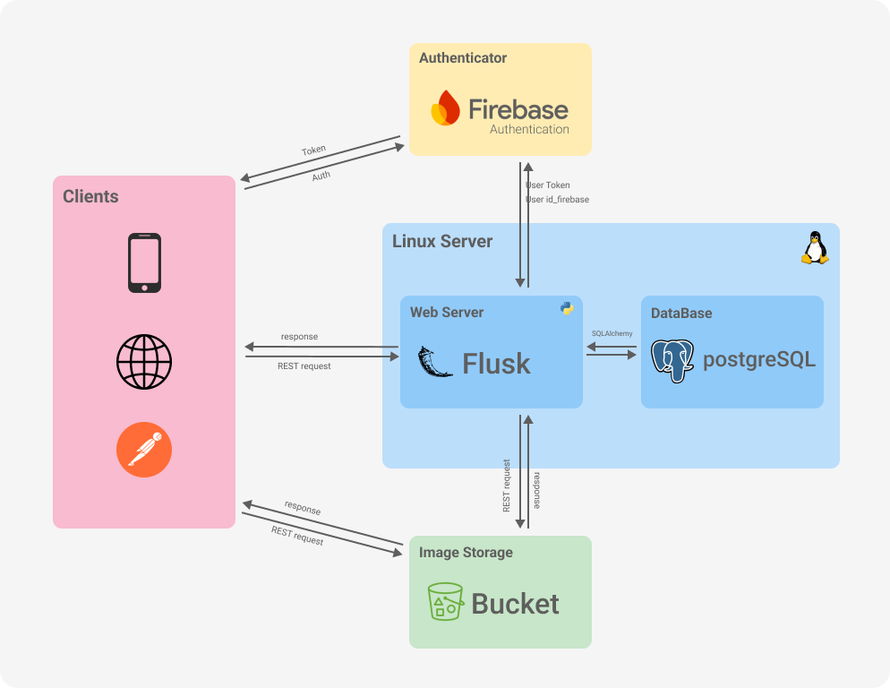

# MountainMates Server 🏔️

Welcome to MountainMates Server, the robust backend powering the MountainMates application! This Flask-based API manages user accounts, hiking trips, and trip templates, making it easier than ever to organize and participate in hiking excursions.

## 🌟 Features

- User account management
- Hiking trip organization
- Trip template creation and management
- RESTful API architecture
- Firebase authentication integration
- Swagger API documentation

## 🏗️ System Architecture
MountainMates follows a modern, distributed architecture designed for scalability and performance. Here's an overview of our system components and their interactions:



## 🛠️ Technologies

- Flask: Web framework for building the API
- Flask-SQLAlchemy: ORM for database interactions
- Flask-Migrate: Database migration management
- Firebase Admin SDK: User authentication
- Flask-RESTX: Simplifies RESTful API creation and Swagger documentation
- PostgreSQL: Relational database for data storage
- Docker: Application containerization
- Gunicorn: Production-grade WSGI server

## 🚀 Getting Started

### Prerequisites

- Docker
- Docker Compose

### Setup

1. Clone the repository:
   ```
   git clone https://github.com/vedovati-matteo/MountainMates_server.git
   cd MountainMates_server
   ```

2. Place your `firebase-credentials.json` file in the `/WebServer/` directory within the project

3. Create a .env file in the project root and add the necessary environment variables:
   ```
   FIREBASE_CREDENTIALS_PATH=firebase_credential.json
   FIREBASE_WEB_API_KEY=<firebase-web-api-key>
   POSTGRES_PASSWORD=mysecretpassword
   FLASK_DEBUG=0 # Set 0 for production and 1 for development
   ```

4. Build and start the Docker containers:
   ```
   docker-compose up --build
   ```

5. The API will be available at `http://localhost:5000`

### Database Migrations

If you need to run database migrations, you can use the following commands:

1. Initialize the migration environment (if it's the first time):
    ```
    docker-compose exec app python manage.py db init
    ```

2. Generate a new migration script (after making changes to your models):
    ```
    docker-compose exec app python manage.py db migrate
    ```

3. Apply the migrations:
    ```
    docker-compose exec app python manage.py db upgrade
    ```

## 📚 API Documentation

- Access the Swagger UI documentation at `http://localhost:5000/api/doc/` when the server is running.
- For static documentation, refer to the [swagger docs](https://vedovati-matteo.github.io/MountainMates_server/swagger.html).
- To update or regenerate the static documentation, please refer to the README file inside the `static` folder for detailed instructions.

## 🔑 Authentication Helper

We provide a helper script `auth_token_getter.py` to simplify API testing without a frontend. This script allows you to obtain a Firebase ID token for a specific user, which you can then use to authenticate API requests.

### Usage:

Run the script with either a user's UID or email and password as arguments:

```
python auth_token_getter.py <user_uid>
```
or
```
python auth_token_getter.py <user_email> <user_password>
```

The script will output a Firebase ID token that you can use in your API requests.

Note: This script is particularly useful for testing APIs in the Swagger UI (`/api/doc/`). You can use the generated token in the Swagger UI's "Authorize" feature to authenticate your requests.

## 🧪 Testing

Run the unit tests using:

```
docker-compose exec app python manage.py test
```

## 🔒 Security

- User authentication is handled via Firebase ID tokens.
- Ensure to keep your `.env` file and Firebase credentials secure and never commit them to version control.

## 🤝 Contributing

We welcome contributions! Please feel free to submit a Pull Request.

## 📄 License

This project is licensed under the MIT License - see the [LICENSE](LICENSE) file for details.

## 📞 Support

If you encounter any issues or have questions, please file an issue on the GitHub repository.

Happy hiking with MountainMates! 🥾🏞️
